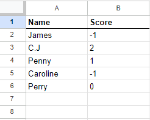
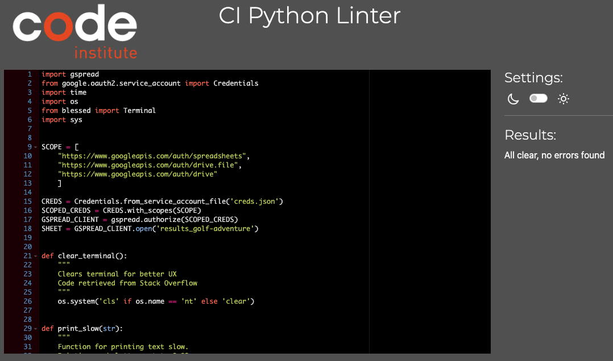

# Golf Adventure
[Gold Adventure](xxxxx) is a short version for a round of golf and are played in a python terminal. The player will have to choose between two options on each shot, both choices have different outcome. So the player has to guess which shot will get the ball closer to the hole, to receive the lowest possible score.

---

### How to use    
1. To be able to play the game, you have to click this [link](xxxxx), or copy `https://www.....` and paste into your browser's address bar and press enter.
2. When the page is loaded, click "RUN PROGRAM", and the game will load.
3. Enter your name when told to, use only letters(no whitespace) and press Enter.
4. Now you'll be taken to the clubhouse, where you can either choose to play game, check out the leaderboard, read the rule book or leave the game. Navigate using your keyboards numbers 1-4 and hit enter.
5. When start a game, your caddie will give you instructions for the hole and which options that are available for the upcoming shot. When told to enter your choice, use your keyboards number and hit enter. The caddie will give you new instructions and options for the next shot. The caddie will do so until the ball is in the hole. You can choose to leave the game at any time, just follow the instructions.
6. When the ball is in the hole, the caddie presents your result and you can choose to submit your score and head back to the clubhouse or you can choose to leave the game without submitting your score. Follow the instructions and use your keyboards numbers and hit enter to make your choice. A Google spreadsheet is automatically collecting your score when submitted.
7. When returning to the clubhouse you can now choose to check out the leaderboard using your keyboards numbers and hit enter. The leaderboard is collecting the top 5 scores from the Google spreadsheet.

---

### User stories
- As a first-time player I want the game to be easy to understand and simple to play. So I've tried my best to explain how it works in the rule book and let the player only use the numeric keyboard instead of mixing it up with letters, except of course when entering the players name.
- For a player that wants to try and get the highscore it's easy to just launch the game again and try another path to shoot a lower score than previous rounds.

---

### Features
- ##### Welcome message.
When starting the game the player will receive a welcome message where the caddie presents himself and the player is asked to enter it's name.
For a better UX I've added green color to the welcome message, using the blessed package.
When entering the player name the player is asked to provide it with only letters, no whitespace. Or else it will return a Invalid name error and ask the player to give it another try. The error message is red, to make it more obvious that something went wrong.
When the player have entered a valid name it will clear the terminal and thank the player for submitting a name and send them to the "clubhouse".

For UX I've added the time.sleep function to make the letters appear one after each other, I think it makes the text easier for the player to read and follow along.

- ##### Clubhouse.
When entered a valid name on the welcome message, the terminal will clear screen and thank the player for submitting name along with the clubhouse menu options. The welcome message is printed in green along with the inserted name.

In the clubhouse menu the player is given 4 options: either to start the game by entering keyboard number 1 + enter-key, check out the leaderboard by pressing 2 +enter-key, read the rule book of the game by pressing 3+enter-key or leave the game by pressing 4+enter-key.
If the player use an invalid keyboard option a error message will appear in red colored text to make it obvious that something went wrong and the player will have to try again. 
When entering a valid option the terminal is cleared, then printing a message of "Loading leaderboard..." or "Launching game..." etc. Then the terminal is cleared again before showing the players option content.

- ##### Start Game.
Before the game starts a print message is shown as "Launching the game...", then the terminal is cleared before the caddie gives the player instructions about the hole and what options for the first shot the player can choose between.
The player chooses the next shot by using the numeric keyboard and enter-key. On each shot options the player can choose to leave the game. If entering a letter or a symbol an error message will appear in red text telling the player something went wrong and asks to enter option again.

The text is printed using the time.sleep function to make the letters appear one after each other, I think it makes the text easier for the player to read and follow along.

- ##### Next shot.
After choosing a shot, the caddie will present it's outcome followed by instructions for the next shot and it's options. This procedure will continue until the ball is in the hole.
The terminal will clear and show the outcome for this shot, or print a welcome back message if the player chooses to leave the game.

The player chooses the next shot by using the numeric keyboard and enter-key. On each shot options the player can choose to leave the game. If entering a letter or a symbol an error message will appear in red text telling the player something went wrong and asks to enter option again.

The text is printed using the time.sleep function to make the letters appear one after each other, I think it makes the text easier for the player to read and follow along.

- ##### Submit score or leave game.
When the ball is in the hole, the caddie will present the score for the round and ask the player if it wants to submit score and head back to the clubhouse or leave the game without submitting score. The terminal will clear and either load the clubhouse or print a welcome back message, depending on the players choice.

The player chooses it's option using the numeric keyboard and enter-key. If entering a letter or a symbol an error message will appear in red text telling the player something went wrong and asks to enter option again.

The text is printed using the time.sleep function to make the letters appear one after each other, I think it makes the text easier for the player to read and follow along.

- ##### Leaderboard.
In the clubhouse if the player chooses the check out the leaderboard, the terminal will clear and print "Loading leaderboard..." before showing it's content.
The leaderboard is connected to Google spreadsheet using API's and retrieve the top 5 scores with name and score. The score is shown in negative or positive numbers, as they are in the actual game of golf.
The heading on the leaderboard is green colored.

When done with the leaderboard the player is asked to press 1+enter-key to head back to the clubhouse. If entering a invalid choice (letter or symbol) an error message is shown in red colored text, and asks the player to try again.

- ##### Rule book.
If the player wants to read about the rules of the game it presses 3 on the numeric keyboard + enter-key. 
The rule book is loaded using the file.read() function, because the content of the rule book is stored in a text file on the text_files folder in the workspace.

When done reading the rule book the player is asked to press 1+enter-key to head back to the clubhouse. If entering a invalid choice (letter or symbol) an error message will appear in red colored text, and asks the player to try again.

- ##### Leave game.
The player can leave the game at any time. There's options for that in the clubhouse and after each shot. The player is informed how to do so and just needs to follow the instructions provided. When they leave the game a welcome back message appears in the terminal.
If the player entered a invalid choice (letter or symbol) an error message will appear in red colored text, and asks the player to try again.

- ##### Invalid choice message.
When the player enters a invalid input, whether it's entering numbers or symbols in the name input, or letters or symbols in the play shot input, they receive a error message, telling the player that something went wrong and asks them to try again.
The error message is red colored to make it obvious for the player.

- ##### Spreadsheet.
When submitting score the linked spreadsheet is provided with players submitted name and the score for the round, the spreadsheet will hold and store data so that I can see how many players actually has played the game.
The spreadsheet is also the source for the check leaderboard function, which gathers the top 5 results and print for the player when asked to do so.

---

### Future features
- More holes
- Add random outcome for each shot

---

### Flowchart
In this flowchart you can see the logic that i tried to apply to the game.

---

### Technologies used

###### Languages

- [Python](https://www.python.org/): The main language used to develop the game.
- [JavaScript](https://www.javascript.com/): The language used by the Code Institute to run the mock terminal in the browser.
- [HTML](https://www.w3schools.com/html/): The language used by the Code Institute to create the layout needed to run the mock terminal in the browser.

###### Frameworks, libraries, and packages
- [time](https://docs.python.org/3/library/time.html): Used to add sleep function and UX.
- [blessed](https://pypi.org/project/blessed/): Used to add colors to the text and UX.
- [os](https://docs.python.org/3/library/os.html): Used for clear terminal function.
- [sys](https://docs.python.org/3/library/sys.html): Used for print slow function.

###### Other tools
- [GitHub](https://github.com/): Used to host source code.
- [CodeAnywhere](https://app.codeanywhere.com/): Used to write source code.
- [Chrome](https://www.google.com/chrome/): Used to run game in browser.
- [Lucidchart](https://www.lucidchart.com/): Used for create flowchart.
- [CI Python Linter](https://pep8ci.herokuapp.com/): Used to test code.

---

### Bugs and issues

- ##### Solved bugs
- Update leaderboard function didn't handle int's correctly when returning them to check leaderboard function.
    - Fixed by turning both player name and score to strings and making sure both columns in the spreadsheet is formatted to text, not numbers.
- Print messages too long for terminal in browser.
    - Fixed by adding new lines where needed.

- ##### Unsolved bugs
No unsolved bugs.

---

### Testing
The game was tested continuously in CA terminal to make sure each function worked as expected. When finishing the structure of the whole code i deployed in Heroku to test it in the browser environment.

#### Manual Testing
| Feature Tested | Expected Outcome | Result | Pass/Fail |
| --- | --- | --- | --- |
| Welcome message | Welcomes the player and asks for name input | Shows message and asks to enter valid name | Pass |
| Check for valid name | Make sure no numbers or symbols are entered within name | Show error message if entered numbers or symbols | Pass
| Clubhouse - Start game | Shows intro of first hole with options to select shot or exit game | Shows caddie instructions and option to play first shot and exit game | Pass |
| Clubhouse - Leaderboard | Retrieve scores from spreadsheet, narrow down to top 5 and show return to clubhouse option | Shows leaderboard, 5 scores and return to clubhouse option | Pass |
| Clubhouse - Rule book | Read content in txt.file and print to terminal, with option to return to clubhouse | Shows rule book and option to return to clubhouse | Pass |
| Exit game | Show a welcome back message and end script | Shows a welcome back message | Pass |
| Shot functions | Display a comment from caddie: result from previous shot, options for next shot and leave game option | Shows comment from caddie and options for next shot | Pass |
| Check for invalid input when choosing shot | Make sure no letters or symbols are entered | Error message appears when entered letters or symbols or irrelevant numbers | Pass |
| Submit score | Update spreadsheet with entered player name and score from round | Spreadsheet is updated | Pass |
| 

###### Validator results

The code was run through [CI PEP8 online validator](https://pep8ci.herokuapp.com/#) with no warnings or errors.

---

### Deployment
The game is deployed on Heroku, and can be accessed through this link: [Golf Adventure](xxxxxxx).

**Steps to deployment:***

1. Create a Heroku account if you don't have one.

2. In the dashboard, go to the "Apps" tab.

3. Click on the "New" button and choose "Create a new app".

4. Enter a name for the app.

5. Choose a region.

6. Click on the "Create" button.

7. Open the app you created and go to the "Settings" tab.

8. At the "Config Vars" section, you have to add two keys:

    - key: `PORT`
    - value: `8000`

    - key: `CREDS`
    - value: Insert code from your creds.json file

9. At the "Buildpacks" section, click on the "Add" button and choose:

    - Python
    - Node.js
    The order of the buildpacks is important.

10. After that, click on the "Deploy" tab.

11. At the "Deployment method" section, choose GitHub and connect your GitHub account.

12. Then, you need to choose the repository you want to deploy.

13. Go down to the "Manual deploy" section, choose the branch you want to deploy, and click on the "Deploy branch" button.

14. The application will be deployed to Heroku. You can access it by clicking on the "View" button.

---

### Credits
- Thank you [Aleksei Konovalov](https://github.com/lexach91) for the mentoring during this project and guidance on how to use colors using the blessed package.
- Thank you ["Sebastian"](https://stackoverflow.com/users/1366738/sebastian) for guidance on Stack Overflow on how to use the print slow function.
- Thank you [Anna Greaves](https://github.com/AJGreaves) for the Love Sandwiches walkthrough which inspired a lot when writing this code.
- Thank you [Hussain Naik](https://github.com/Hussain-Naik) for the inspiration for how to set up a well structured README file. 

- And thank you visitor for viewing my repo, and if you played the game - I hope you enjoyed it! Feel free to feedback me with your thoughts and opinions!

Have a nice day!